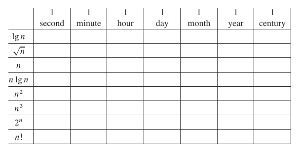

# Table of Contents
1. [Big O Notation](#1-big-o-notation)
    - 1.1 [list of notations](#11-list-of-notations)
    - 1.2 [choosing the approach based on input size](#12-choosing-the-approach-based-on-input-size)
    - 1.3 [how to calculate no. of operations, time constaint based on complexity](#13-how-to-calculate-no-of-operations-time-constaint-based-on-complexity)
2. [Next Topic](#2-next-topic)

---

## 1. Big O Notation
**Big O notation** is a mathematical way to describe how an algorithm’s performance _(usually time used)_ scales as the input size grows. It ignores exact execution times or hardware differences, focusing instead on the upper bound of the growth rate to help developers write scalable code.

### 1.1 List of Notations:

- **O(1) - Constant Time**: Performance remains the same regardless of input size. (e.g. accessing an item in an array by its index).
- **O(log n) - Logarithmic Time**: Performance scales slowly. As the input doubles, the number of operations only increases by a small, fixed amount. (e.g. binary search).
- **O(n) - Linear Time**: The number of operations scales directly in proportion to the input size. (e.g. searching for an unsorted item).
- **O(n log n) - Linearithmic Time**: Common in efficient sorting algorithms where each item is processed logarithmically. (e.g. merge sort, heap sort).
- **O(n2) - Quadratic Time**: The number of operations grows proportionally to the square of the input. As inputs get large, these algorithms slow down drastically. (e.g. bubble sort).
- **O(nc) - Polinomiale**: The number of operations grows proportionally to the input size raised to a constant power c (where c > 2, such as cubic time O(n3)). While still considered _"feasible"_ in theorety, these algorithms slow down heavily as inputs grow. (e.g. the naive three-nested-loops approach to the 3-Sum problem).
- **O(2n) - Exponential Time**: The number of operations doubles with every additional input. These algorithms become extremely inefficient very quickly. (e.g. solving the traveling salesperson problem via brute force).

> Using **Big O notation** is crucial when writing code, as it helps us determine whether a solution is feasible even before we start coding. If the code's complexity is O(2n) we already know there has to be a more efficient solution.

> **note**: obviously, some problems inherently require an exponential complexity. For instance, the _Towers of Hanoi_ problem requires an $O(2^n)$ time complexity because the sequence of steps itself is $2^n$ operations long.

### 1.2 Choosing the Approach Based on Input Size

Estimating the efficiency of a solution is one of the most common tricks used by programmers and in coding competitions. It's called **Target Run Time Analysis**. Modern computers perform about $10^8$ (100 million) operations per second in a single thread. Knowing that the maximum allowed execution time for an algorithm is usually **_1 or 2 seconds_**, you can look at the maximum input size ($n$) and immediately understand the maximum complexity you can afford.

| Input Size ($n$) | Maximum Allowable Complexity | Typical Algorithms / Approaches |
| :--- | :--- | :--- |
| **$n \le 10$** to **$12$** | $O(n!)$ or $O(n^2 \cdot 2^n)$ | Permutations, brute-force search |
| **$n \le 20$** | $O(2^n)$ | Backtracking, Dynamic Programming with bitmasks |
| **$n \le 500$** | $O(n^3)$ | Matrix multiplication, Floyd-Warshall algorithm |
| **$n \le 5,000$** | $O(n^2)$ | Double nested for-loops, Bubble Sort, Insertion Sort |
| **$n \le 10^5$** to **$10^6$** | $O(n \log n)$ or $O(n)$ | Sorting (Merge/Quick Sort), Hash Maps/Sets, Two-pointers |
| **$n \le 10^8$** | $O(n)$ | A single, simple linear for-loop |
| **$n > 10^8$** | $O(\log n)$ or $O(1)$ | Binary Search, direct mathematical formulas, Bitwise operations |

Therefore, looking at the input size you can instantly determine which solutions are worth considering.

> **note**: this table is created considering the TLE of 1 second. If we consider a bigger Time Constaint (2, 4, 10 seconds) the table would change slightly.

### 1.3 How to Calculate no. of Operations, Time Constaint based on Complexity

In the book _"Introduction to Algorithms"_ at page 15 there is this table:

  
   
  <i>Time Complexity on the left and Time Constraint above</i>

The goals is:

> for each function $f(n)$ and time $t$ in the table, determine the **largest size n** of a problem that _can be solved in time_ $t$, assuming that the algorithm to solve the problem takes $f(n)$ _microseconds_.

Therefore, for each function we have to solve: $$f(n) \le t$$

### First Step
First of all, let's convert the time constaints in microseconds:
- 1 second = $10^6\ \mu s$
- 1 minute: $60 \times 10^6 = 6 \times 10^7\ \mu s$
- 1 hour: $60 \times 60 \times 10^6 = 3.6 \times 10^9\ \mu s$
- 1 day: $24 \times 3.6 \times 10^9 = 8.64 \times 10^{10}\ \mu s$
- 1 month _(assuming 30 days)_: $30 \times 8.64 \times 10^{10} = 2.592 \times 10^{12}\ \mu s$
- 1 year _(365 days)_: $365 \times 8.64 \times 10^{10} = 3.1536 \times 10^{13}\ \mu s$
- 1 century: $100 \times 3.1536 \times 10^{13} = 3.1536 \times 10^{15}\ \mu s$

### Second Step
Now, for each function $f(n)$ we find a way to solve it _for_ $n$:
- For $\lg n$:\
$\lg n = t \implies n = 2^t$
- Per $\sqrt{n}$:\
$\sqrt{n} = t \implies n = t^2$
- Per $n$:\
$n = t$
- Per $n \lg n$:\
$n \lg n = t$. This cannot be solved analytically in a simple way. You will need to use a numerical method (such as approximation or the bisection method) or a calculator to find the closest value of $n$ by trial and error.
- Per $n^2$:\
$n^2 = t \implies n = \lfloor\sqrt{t}\rfloor$
- Per $n^3$:\
$n^3 = t \implies n = \lfloor\sqrt[3]{t}\rfloor$
- Per $2^n$:\
$2^n = t \implies n = \lfloor\lg t\rfloor$
- Per $n!$:\
$n! = t$. Here too, we proceed by trial and error, incrementing $n$ (e.g. $1!, 2!, 3!...$) until the factorial exceeds the available time $t$.

### Third Step (solution for 1 second)

Now, we can use the $t$ value calculated in the first step and the $n$ _resolution formula_ calculated in the second step to find the **maximum input size** $n$ that can be processed in **1 second** ($t = 10^6$ microseconds) for each running time function $f(n)$.

| Function $f(n)$ | Resolution Formula | Calculation for 1 second ($t=10^6$) | Final Result (Maximum $n$) |
| :--- | :--- | :--- | :--- |
| $\lg n$ | $2^t$ | $2^{10^6}$ | $2^{1000000}$ |
| $\sqrt{n}$ | $t^2$ | $(10^6)^2$ | $10^{12}$ |
| $n$ | $t$ | $10^6$ | $10^6$ ($1,000,000$) |
| $n \lg n$ | Numerical Approximation | $n \lg n = 10^6$ | $\approx 62,746$ |
| $n^2$ | $\sqrt{t}$ | $\sqrt{10^6}$ | $1,000$ |
| $n^3$ | $\sqrt[3]{t}$ | $\sqrt[3]{10^6}$ | $100$ |
| $2^n$ | $\lg t$ | $\log_2(10^6)$ | $19$ |
| $n!$ | Trial and Error | $9! \le 10^6 < 10!$ | $9$ |

To find the solutions for the other time constaint we follow the same logic.

## 2. Next Topic